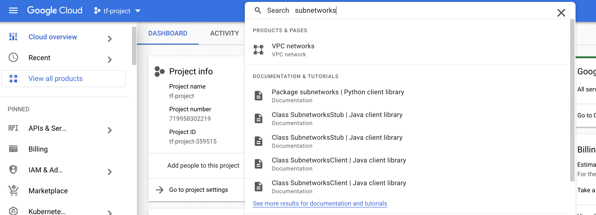

# Create a Network

Lab Objective:
- Create a simple network in GCP

## Lab

### Change to use GCP Provider

Open `main.tf` for edit and make the following changes:

1. Add GCP as a required provider.  We continue to use GCP for storing backend state.  The terraform block in main.tf should look as follows:

```
terraform {
  required_providers {
    random = {
      source  = "hashicorp/random"
      version = "~> 2.3.0"
    }
    google = {
      source = "hashicorp/google"
      version = "4.31.0"
    }
  }
  backend "gcs" {
    prefix  = "terraform/state"
  }
  required_version = "> 1.0.0"
}
```

2. Add a provider block to configure the GCP provider.  The configuration specifies the GCP region into which we will create our infrastructure, as well as declares some common tags to associate to all created resources.  Replace "tf-project-000000" with your project name.

```
provider "google" {
  project     = "tf-project-000000"
  region      = "us-central1"
}
```

3. Delete the "random_number" resource from the file.  We no longer need that resource. (Keep the "random" provider since we will use it again later.)

---

### Define Network Resources

Create a new file `network.tf`.
```
touch network.tf
```

Either copy the contents of network.tf from the solution folder for the lab, or copy the code snippets in the following descriptions.

We will be defining a number of new resources in this file.  Let's walk through them.

1. A firewall object for the network

```
resource "google_compute_firewall" "lab" {
  name          = "lab"
  network       = google_compute_network.lab.name
  allow {
    protocol    = "icmp"
  }
  allow {
    protocol    = "tcp"
    ports       = ["22", "80", "443", "8000-8999"]
  }
  source_ranges = ["0.0.0.0/24"]
}
```

2. A Google compute network for our lab.

```
resource "google_compute_network" "lab" {
  name = "lab"
  auto_create_subnetworks = false
}
```

3. A public network  

```
resource "google_compute_subnetwork" "lab-public" {
  name          = "lab-public"
  ip_cidr_range = "10.0.0.0/24"
  region        = "us-central1"
  network       = google_compute_network.lab.id
}
```

4. A private network

```
resource "google_compute_subnetwork" "lab-private" {
  name          = "lab-private"
  ip_cidr_range = "10.0.1.0/24"
  region        = "us-central1"
  network       = google_compute_network.lab.id
}
```

5. A network router

```
resource "google_compute_router" "lab" {
  name    = "lab-router"
  region  = "us-central1"
  network = google_compute_network.lab.id
  bgp {
    asn = 64514
  }
}
```

6. A NATing rule

```
resource "google_compute_router_nat" "lab" {
  name                               = "lab-router-nat"
  router                             = google_compute_router.lab.name
  region                             = "us-central1"
  nat_ip_allocate_option             = "AUTO_ONLY"
  source_subnetwork_ip_ranges_to_nat = "ALL_SUBNETWORKS_ALL_IP_RANGES"
  log_config {
    enable = true
    filter = "ERRORS_ONLY"
  }
}
```

Stop to think a minute about the infrastructure we have defined. Does it make sense?

Run terraform init.  Do you know why we need to re-run this command?
```
terraform init
```
Run terraform validate.
```
terraform validate
```
Run terraform plan.  Look though the plan to confirm it matches what you would expect.
```
terraform plan
```
If you see in the plan that random_integer.number is to be destroyed, that is okay.  Do you know why this is happening?

Run terraform apply to create all the new infrastructure. *Be sure to type 'yes' to perform the actions.*
```
terraform apply
```

### Viewing Results in the GCP Management Console

Let's use the GCP Console to see what you just created.  Go to the browser in which you logged into the Console UI.

In the search bar at the top of the GCP Console page, type "subnetworks".  Select the "VPC Networks" service from the drop-down.


<br /><br />

On the VPC dashboard page, scroll down to find the new subnets.  You will see two subnets listed.  One has the name "lab-public" the other has the name "lab-private"


